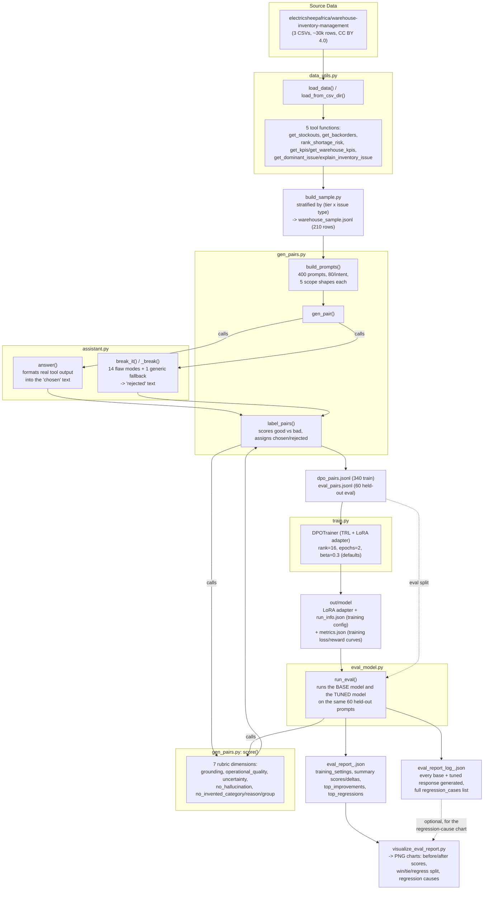
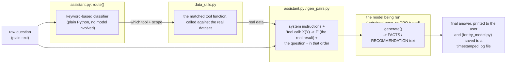

# Warehouse short-order assistant - DPO pipeline

Loads a warehouse dataset, builds some tool functions
over it, has an assistant answer questions using those tools, makes
grounded vs broken versions of the answers, scores them with a rubric to
get DPO pairs, trains a small model with DPO (LoRA), and evaluates
before/after.

## Architecture

This is a warehouse short-order assistant: a small language model that
answers real inventory questions - stockout risk, backorders, KPI
summaries, why a given warehouse is failing fulfillment - grounded in a
real warehouse-inventory dataset. It's tuned with **DPO (Direct
Preference Optimization)**, a training method that improves a model by
repeatedly showing it a pair of candidate answers for the same question
- one labeled `chosen`, one labeled `rejected` - and adjusting the model
to prefer generating text like the `chosen` one. No human raters or
larger "teacher" LLM label these pairs here; a fixed, code-based rubric
does (see `RUBRIC.md`).

There are two distinct flows through the codebase, described separately
below: the **offline pipeline** that builds the training data, trains
the model, and evaluates it, and the **live query path** that answers
one real question using whatever model (untrained or DPO-tuned) you
point it at. Both share the same underlying tool functions and scoring
logic, but run at completely different times - the offline pipeline
runs once (or once per experiment) to produce a trained model; the live
query path runs every time someone actually asks a question.

## 1. Offline pipeline: data → preference pairs → DPO training → evaluation



**A few things worth calling out explicitly:**

- **`chosen` and `rejected` are both built by code, not written by a
  human or another AI.** `answer()` calls a real tool function against
  the real dataset and formats the true result - that's `chosen`.
  `break_it()` takes that same correct text and deliberately corrupts
  it (a wrong number, an invented category, an unwarranted "not sure"
  on a fully-answerable question, etc.) - that's `rejected`. Both then
  get scored by the same rubric, and whichever scores higher is what
  actually gets labeled `chosen` - in the large majority of cases this
  is the real, uncorrupted answer, since it's rare for a deliberately
  broken response to accidentally score better.
- **`run_info.json`** (written once per training run, inside `out/model`)
  is what lets the evaluation report say which settings (LoRA rank,
  DPO beta, epochs, learning rate, which base model) actually produced
  the model being evaluated, without having to remember or dig through
  console logs.

## 2. Live query path: one question in, one grounded answer out

This is what actually happens when a real question gets asked, either
through a script (`try_model.py`) or as part of building the training
data above (`gen_pair()` calling into the same functions).

**Important design point:** the model itself never decides which tool
to call, and never sees a question without also already having the
real data needed to answer it. A separate, simple keyword-matching
function (`route()`) figures out which of the 5 tools the question
needs and calls it - entirely in plain Python, no model involved - and
only *then* does the model get a single prompt containing both the
real tool result and the question together. See "Routing" section for 
the full reasoning behind this choice over having the model call tools itself.



**Entry points for this path:**
- `ask.py` - a CLI demo with **no model at all**, just the  +
  templated answer, useful for sanity-checking the tool logic itself.
- `try_model.py` - runs an actual model (either the DPO-tuned one, or
  the original untrained base model via `--base-only`) against one
  live question, and saves the question,  decision, full
  prompt, and response to a timestamped log file
  (`out/try_model_log_<timestamp>.json`) so past test runs aren't lost.


## reports and docs

- [`RUBRIC.md`](RUBRIC.md) - the full 7-dimension scoring rubric used to
  build DPO preference pairs and to evaluate the trained model.
- [`assets/PROJECT_EVALUATION_REPORT.md`](assets/PROJECT_EVALUATION_REPORT.md) -
  project history, base model selection, environment setup, and the final
  evaluation results.

## Running the Pipelines

`base_model` (default `Qwen/Qwen2.5-0.5B-Instruct`) was picked as a
reasonable-sounding default - small, open, instruction-tuned, works
cleanly with TRL/PEFT. To verify it against alternatives without
downloading the full CSVs first:

```
!python compare_models.py --sample
```

(drop `--sample` once you have the real CSVs in `data/`, to compare on
the full dataset instead.)

For the exact commands to run the full pipeline against either the real
3-tier CSVs, the 210-row sample, or pre-generated DPO pairs - including
where each file needs to be placed - see
[`data/README.md`](data/README.md).

This writes to `out/`:
- `records.jsonl` - the normalized data
- `dpo_pairs.jsonl` - the DPO dataset (prompt/chosen/rejected)
- `eval_pairs.jsonl` - held out prompts, never used for training. has real
  `chosen`/`rejected` fields for the eval set as well as the training set. 
  also carries `tool_out`/`scope`/`uncertain` alongside
  those, since `eval_model.py` needs that ground truth to score a model's
  own freshly-generated text, not the pre-built candidates.
- `model/` - the trained adapter + `run_info.json` (config + dataset
  fingerprint) + `metrics.json` (training curve)
- `eval_report_<timestamp>.json` - before/after comparison: baseline_score,
  post_dpo_score, delta, win_rate_vs_baseline, hallucination rate
  before/after, factual correctness, tool use correctness, uncertainty
  handling, top improvements/regressions, plus tool_selection_accuracy.
  Timestamped so re-running doesn't overwrite a previous report.
- `eval_report_log_<timestamp>.json` - the companion to the report above:
  every response either model generated (not just the top few shown in
  the report), plus the full regression list.

You can also just run pieces separately:

```
python train.py out/dpo_pairs.jsonl out/model Qwen/Qwen2.5-0.5B-Instruct
python eval_model.py out/model Qwen/Qwen2.5-0.5B-Instruct out/eval_pairs.jsonl out/eval_report.json out/records.jsonl
```

Or try the live routing yourself:

```
python ask.py "any active stockouts?"
python ask.py "why is WH_0009 at the national_CMS failing fulfillment for vaccines?"
```

Or try inferring the tuned or base model yourself:

```
python try_model.py out/model "how is WH_0009 at the national_CMS doing overall?" --base Qwen/Qwen2.5-0.5B-Instruct --use_full_dataset
python try_model.py --base Qwen/Qwen2.5-0.5B-Instruct --base-only --use_full_dataset "how is WH_0009 at the national_CMS doing overall?"
```

## Datasets

Based on source dataset: [`electricsheepafrica/warehouse-inventory-management`](https://huggingface.co/datasets/electricsheepafrica/warehouse-inventory-management/tree/main/data), 
two datasets derived from the source data are published on Hugging Face:
- [`EnRaoufi/warehouse-inventory-stratified-sample`](https://huggingface.co/datasets/EnRaoufi/warehouse-inventory-stratified-sample)
(the curated sample that `build_sample.py` produces) and
- [`EnRaoufi/warehouse-dpo-preference-pairs`](https://huggingface.co/datasets/EnRaoufi/warehouse-dpo-preference-pairs)
(the DPO `{prompt, chosen, rejected}` pairs that `gen_pairs.py` produces from it).

To see where to place the datasets after dowloading, please refer to [`data/README.md`](data/README.md).

## Python scripts

- `data_utils.py` - loads the data, has the tool functions (get_stockouts,
  get_backorders, rank_shortage_risk, get_warehouse_kpis, explain_inventory_issue)
- `assistant.py` - calls the tools, formats FACTS/RECOMMENDATION answers,
  makes broken versions for the rejected side of DPO pairs, AND has the
  `route()` function that maps a raw question to a tool + scope (see
  "Routing" section below)
- `gen_pairs.py` - builds the prompt list (100+), generates pairs, has the
  scoring rubric, picks chosen/rejected
- `train.py` - DPO training w/ TRL + LoRA
- `eval_model.py` - runs base model and DPO model on the same held-out
  prompts, dumps a report (also runs tool-selection accuracy separately)
- `run.py` - runs the whole thing
- `ask.py` - live demo: `python ask.py "any active stockouts?"` - actually
  routes a raw question and answers it, no pre-known intent
- `compare_models.py` - zero-shot comparison of candidate base models
  BEFORE committing to one for DPO training (see "Running the Pipelines"
  above)
- `data/warehouse_sample.jsonl` - a 210-row real subset
  (pulled straight from the actual CSVs, with coverage of every issue type
  and all 3 warehouse levels). 
- `build_sample.py` - regenerates warehouse_sample.jsonl from the real 3
  CSVs (`python build_sample.py --data-dir data`). 

## Routing

**how the "LLM" picks the right tool**:
`assistant.route()` is a **plain keyword classifier**, not the model doing real function-calling.
It looks at the raw question text for words like "backorder", "stockout",
"shortage"/"risk", pulls out a warehouse id via regex (`WH_\d+`) and a
commodity category by checking which real category names from the data
appear in the text, and picks one of the 5 required tools based on that.

## Evaluation notes

Ran this a bunch during dev to make sure the rubric actually distinguishes
good from broken answers across 15 different random
seeds on the real 210-row sample.

router (`assistant.route()`) gets 100% on the tool-family questions this
pipeline itself generates, across 10 seeds - makes sense since the keyword
matching was built to match the exact phrasing in `gen_pairs.py`'s
templates. Real user phrasing would probably do worse; this hasn't been
tested against phrasing the router wasn't designed around.

The full pipeline that produced the final evaluation results 
(data generation through training and evaluation) was run twice, end to end, 
on the same configuration. Both runs produced stable DPO training outcomes 
and evaluation results, with no meaningful run-to-run variation - reasonable
 confidence the reported numbers reflect the actual behavior of this setup, 
 not a lucky single run.
 not a lucky single run.
