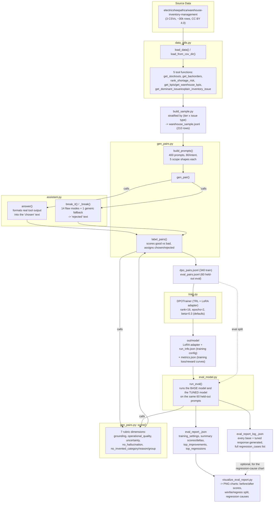
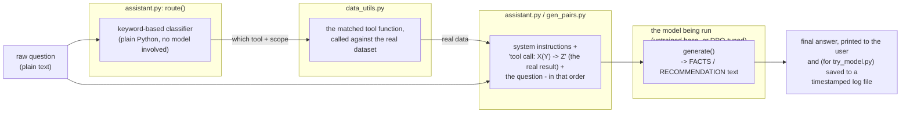

# Architecture

## Warehouse Short-order Assistant Pipelines

This is a warehouse short-order assistant: a small language model that
answers real inventory questions - stockout risk, backorders, KPI
summaries, why a given warehouse is failing fulfillment - grounded in a
real warehouse-inventory dataset. It's tuned with **DPO (Direct
Preference Optimization)**, a training method that improves a model by
repeatedly showing it a pair of candidate answers for the same question
- one labeled `chosen`, one labeled `rejected` - and adjusting the model
to prefer generating text like the `chosen` one. No human raters or
larger "teacher" LLM label these pairs here; a fixed, code-based rubric
does (see `RUBRIC.md`).

There are two distinct flows through the codebase, described separately
below: the **offline pipeline** that builds the training data, trains
the model, and evaluates it, and the **live query path** that answers
one real question using whatever model (untrained or DPO-tuned) you
point it at. Both share the same underlying tool functions and scoring
logic, but run at completely different times - the offline pipeline
runs once (or once per experiment) to produce a trained model; the live
query path runs every time someone actually asks a question.

## 1. Offline pipeline: data → preference pairs → DPO training → evaluation

**A few things worth calling out explicitly, since they're not obvious
just from the shapes above:**

- **`chosen` and `rejected` are both built by code, not written by a
  human or another AI.** `answer()` calls a real tool function against
  the real dataset and formats the true result - that's `chosen`.
  `break_it()` takes that same correct text and deliberately corrupts
  it (a wrong number, an invented category, an unwarranted "not sure"
  on a fully-answerable question, etc.) - that's `rejected`. Both then
  get scored by the same rubric, and whichever scores higher is what
  actually gets labeled `chosen` - in the large majority of cases this
  is the real, uncorrupted answer, since it's rare for a deliberately
  broken response to accidentally score better.
- **The evaluation report and the "log" file are deliberately
  separate files.** The report is meant to be read directly - it has
  the summary numbers and just the handful of most-improved/
  most-regressed examples. The log has everything: the full text of
  every single response either model generated during that eval run,
  and the complete list of every regression (not just the top few) -
  useful for deeper debugging, but too much to put in the file someone
  opens first.
- **`run_info.json`** (written once per training run, inside `out/model`)
  is what lets the evaluation report say which settings (LoRA rank,
  DPO beta, epochs, learning rate, which base model) actually produced
  the model being evaluated, without having to remember or dig through
  console logs.

## 2. Live query path: one question in, one grounded answer out

This is what actually happens when a real question gets asked, either
through a script (`try_model.py`) or as part of building the training
data above (`gen_pair()` calling into the same functions).

**Important design point:** the model itself never decides which tool
to call, and never sees a question without also already having the
real data needed to answer it. A separate, simple keyword-matching
function (`route()`) figures out which of the 5 tools the question
needs and calls it - entirely in plain Python, no model involved - and
only *then* does the model get a single prompt containing both the
real tool result and the question together. This means the model's job
is narrow and well-defined: turn already-correct data into a clear,
well-formatted answer - not to figure out what data it needs or how to
get it. See `README.md`'s "routing" section for the fuller reasoning
behind this choice over having the model call tools itself.

**Entry points for this path:**
- `ask.py` - a CLI demo with **no model at all**, just the routing +
  templated answer, useful for sanity-checking the tool logic itself.
- `try_model.py` - runs an actual model (either the DPO-tuned one, or
  the original untrained base model via `--base-only`) against one
  live question, and saves the question, routing decision, full
  prompt, and response to a timestamped log file
  (`out/try_model_log_<timestamp>.json`) so past test runs aren't lost.
