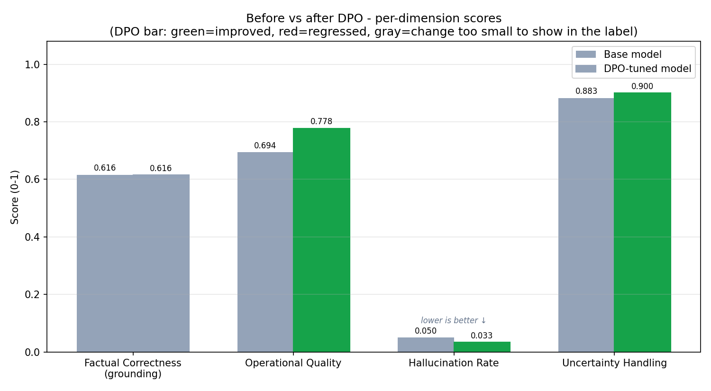
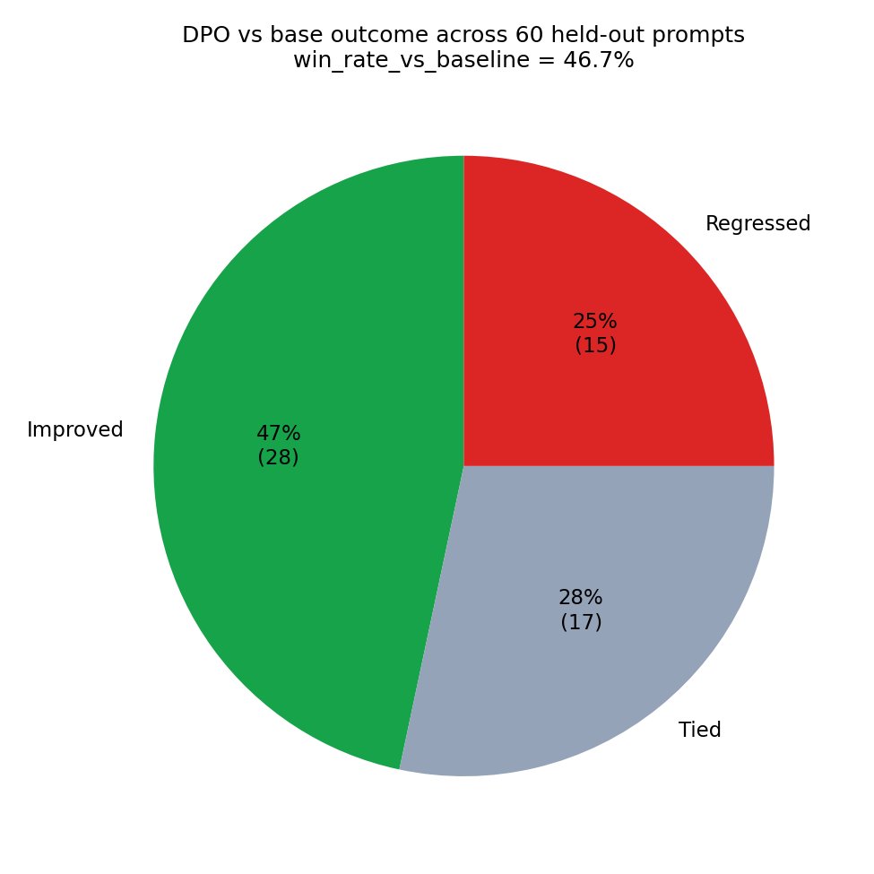
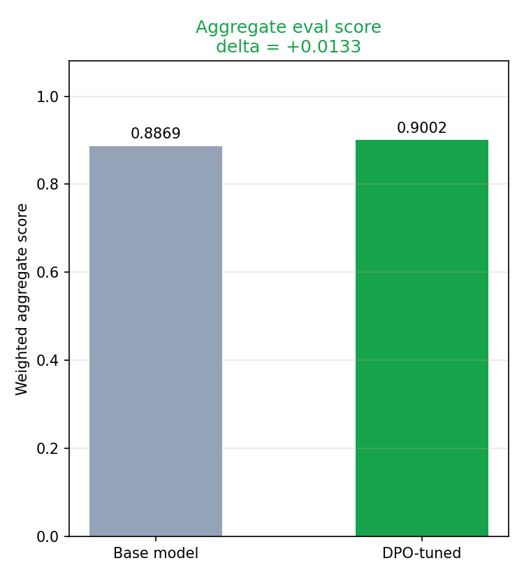
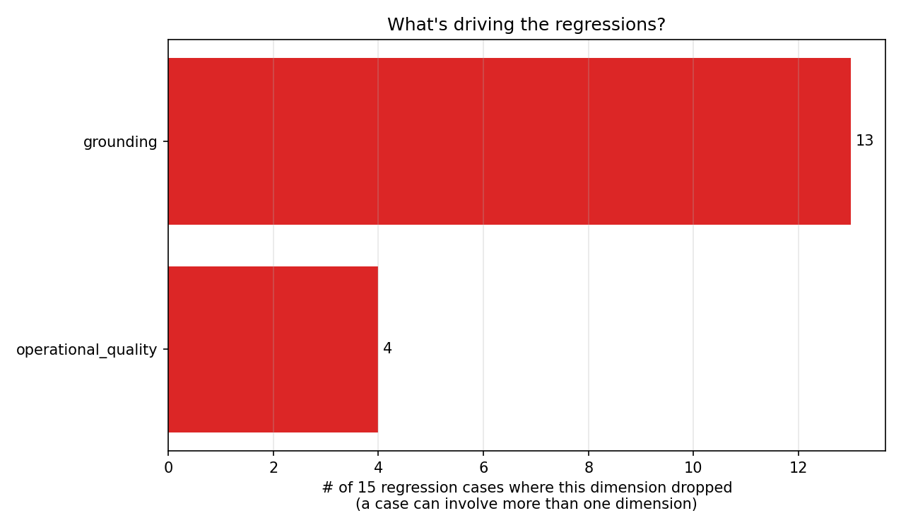

# Warehouse Short-Order Assistant — Evaluation Report

## What this project is

This project trains a small language model to answer real warehouse
inventory questions — stockout risk, backorders, KPI summaries, why a
given warehouse is failing fulfillment — grounded in a real
warehouse-inventory dataset. The model is tuned with **DPO (Direct
Preference Optimization)**: for a set of real questions, I built two
candidate answers each, one correct (`chosen`) and one deliberately
flawed (`rejected`), and trained the model to prefer generating text
like the correct one. No human raters or a larger "teacher" model
label these pairs — a fixed, code-based rubric does, so every run is
reproducible and free to run.

The rest of this report covers, in order: the project's history and why
I chose the base model I did, how I set up my training environment, and
the final evaluation results.

## Project History and Model Selection

### Design choices made early on

- **Rule-based scoring instead of an LLM-as-judge.** Every response in
  this pipeline is grounded in structured tool output (real numbers and
  IDs pulled from the dataset), not free-text retrieved passages, so a
  deterministic check — do the stated values and entities match the
  real tool output — works as a faithfulness proxy without needing a
  paid judge API or a second model call per evaluation. This keeps the
  whole pipeline free, offline, and exactly reproducible. The tradeoff
  is real: rule-based matching can miss semantic errors that keep the
  same words but flip their meaning (a negation, a misattributed
  value) — something an LLM-based check would catch. An opt-in
  LLM-judge evaluation path would be a reasonable extension later,
  while keeping the rule-based check as the fast, free default.
- **Tool function design.** Each of the five required tool functions
  was built with a specific rationale, not just "return the matching
  rows": stockouts are ranked by how many facilities they affect, not
  left in arbitrary order; backorders are ranked by a normalized rate
  (backorders ÷ orders received) rather than a raw count, since a raw
  count is misleading across warehouses of very different sizes; the
  shortage-risk score combines six signals into a transparent,
  hand-weighted heuristic (disclosed as a judgment call, not a fitted
  model, since the dataset has no ground-truth "did a shortage actually
  happen" label to calibrate against); and the issue-explanation tool
  reports the dataset's own recorded reason code directly, rather than
  guessing a cause from correlated signals, and explicitly flags any
  answer built from an unsubmitted report as provisional.

### Bugs found and fixed along the way

- **A real routing bug, found by testing the assignment's own example
  questions.** "Which warehouses have the highest stockout risk" was
  being misrouted to the stockout-listing tool instead of the
  risk-ranking tool, because the keyword matcher checked for the
  substring "stockout" before checking for "risk." Fixed by reordering
  the match priority and broadening keyword coverage for common
  paraphrases ("overdue," "running out," "struggling") that previously
  matched nothing at all. Regression-tested against the full evaluation
  suite before and after to confirm nothing else broke.
- **A grounding-check rigidity that inflated the apparent regression
  rate.** An early evaluation pass showed 13 of 14 post-training
  regressions concentrated entirely in one rubric dimension
  (grounding). Manual inspection showed about half were not real
  errors — the model had learned to phrase the same correct fact more
  naturally ("National CMS" instead of the raw stored value
  "national_CMS," "82%" instead of "82.0%"), and the exact-substring
  check had no tolerance for that. Fixed by normalizing case, delimiter,
  and numeric-format differences before comparing.
- **An evaluation-harness bug that mistook truncated answers for wrong
  ones.** A later pass found 5 of 7 regressions were artifacts, not
  real model problems: the tuned model had learned a more thorough
  answer style, and a hardcoded 100-token generation limit was cutting
  those answers off mid-sentence before all the required facts could be
  stated — the scorer then correctly penalized content the model never
  got the chance to produce. A second, smaller bug in the same pass:
  the number-extraction regex read a stray space inside a decimal
  ("45. 4%") as two separate numbers instead of one, scoring a
  correctly-stated value as missing. Fixing both left only 2 genuine
  regressions out of the original 7.

### Extending question coverage

The assignment names five required tools and gives four example
questions, but nowhere restricts what scope a question can be asked
at — and real warehouse questions are routinely asked at a single
facility, a tier, a region, or as a comparison across them. I extended
the assistant to handle all of these: filtering and comparing across
warehouse tiers and region types, not just single-warehouse or
dataset-wide questions, reusing the same underlying computations
(backorder-rate math, KPI averaging, risk scoring) rather than adding
new business logic. This kept the grounding guarantee intact — every
number in an answer still traces back to a real computation — while
meaningfully widening what the assistant can actually answer.

### The core remaining problem: unwarranted hedging

Across every hyperparameter configuration I tried — LoRA rank 16 or 32,
DPO β at 0.1, 0.3, or 0.4, 2 or 3 training epochs — the tuned model kept
showing one consistent failure: hedging ("Not sure, not enough
information") on questions the base model answered correctly using
data that was fully available. This showed up as a real, repeated drop
in the uncertainty-handling score in every run.

Tracing the cause: the training-pair generator only produced this
specific "unwarranted hedge" rejected example in about 25% of prompts
where real data was actually available, compared to near-100% coverage
for the model's other failure modes. I first fixed this by raising that
rate to roughly 61% — but the regression barely moved. Looking closer
at what the model was actually doing wrong, I found the real failure
didn't look like a blanket refusal at all: the model would state one or
more facts correctly and confidently, then contradict itself in the
recommendation with an unwarranted hedge. My original negative example
(a generic "not sure, check the system" refusal) didn't match that
shape, which likely limited how well the training signal generalized.
I rebuilt the negative-example generator to produce that exact shape —
real facts intact, hedge injected specifically into the recommendation
— plus a second variant for coverage, weighted toward the
better-evidenced pattern. This is what finally resolved the regression
(see Final Results below).

### Model selection

Before committing to a base model, I ran a small 20-prompt comparison
across three candidates: `Qwen2.5-0.5B-Instruct`, `Qwen2.5-1.5B-Instruct`,
and `SmolLM2-360M-Instruct`.

| Model | Avg. score | Factual correctness | Hallucination rate |
|---|---|---|---|
| **Qwen2.5-0.5B-Instruct** | **0.810** | 0.268 | **0.20** |
| Qwen2.5-1.5B-Instruct | 0.780 | 0.295 | 0.55 |
| SmolLM2-360M-Instruct | 0.770 | 0.023 | 0.40 |

Bigger wasn't better here: the 1.5B model scored only marginally higher
on factual correctness but hallucinated far more often (0.55 vs. 0.20),
inventing specifics rather than sticking to the real data. SmolLM2's
numeric scores look reasonable at a glance, but its actual sample
outputs were degenerate — empty strings, or a repeated "no" token with
no real content — which the automated scores alone didn't fully
capture; reading the raw responses mattered as much as the numbers.
`Qwen2.5-0.5B-Instruct` had the best overall score, the lowest
hallucination rate of the three, and — practically important given the
free-tier compute I was working with — the smallest footprint of the
two coherent candidates. It was the clear choice on both quality and
practicality.

## Running Environment

Training and evaluation ran in Google Colab, using TRL's `DPOTrainer`
with a LoRA adapter (via PEFT) rather than full fine-tuning, to keep
memory use and training time manageable on a free GPU tier.

- **Primary environment:** a free-tier Colab **T4** GPU. Most
  development, debugging, and early training runs happened here.
- **Continuation environment:** once free-tier T4 time ran out mid-project,
  I continued the later training and evaluation runs on a **paid Colab
  L4** GPU instance to keep iterating without losing momentum.
- **Practical fixes along the way:** an early attempt to train locally
  failed outright due to a CUDA driver/PyTorch build mismatch, which is
  what pushed the whole workflow onto Colab in the first place.
  `requirements.txt` is pinned to the exact package versions confirmed
  working there. A real out-of-memory crash also showed up during
  evaluation specifically — the default eval batch size was 4x the
  training batch size, on top of DPO's evaluation needing an extra
  reference-model forward pass — fixed by lowering the eval batch size
  and moving evaluation outputs off the GPU incrementally instead of
  holding them all until the end.

## Final Evaluation Results

**Training configuration for this run:**

| Setting | Value |
|---|---|
| Base model | Qwen/Qwen2.5-0.5B-Instruct |
| LoRA rank | 16 |
| LoRA alpha | 32 |
| LoRA dropout | 0.05 |
| LoRA target modules | q_proj, k_proj, v_proj, o_proj |
| DPO beta | 0.3 |
| Epochs | 2 |
| Learning rate | 5e-5 |

**Summary, on 60 held-out evaluation prompts:**

| Metric | Value |
|---|---|
| Baseline score | 0.8869 |
| Post-DPO score | 0.9002 |
| Delta | **+0.0133** |
| Win rate vs. baseline | 46.7% |
| Improved | 28 |
| Tied | 17 |
| Regressed | 15 |

- **Factual correctness (grounding)** held steady (0.616 → 0.616): the
  tuned model preserves its ability to state real, correct facts from
  the data at the same rate as the base model.
- **Operational quality** improved (0.694 → 0.778): responses are more
  consistently well-structured, non-redundant, and complete after
  tuning.
- **Hallucination rate** improved (5.0% → 3.3%): fewer responses
  invent a warehouse ID, category, reason code, or tier/region label
  that doesn't exist in the data.
- **Uncertainty handling** improved (0.883 → 0.900) — and, notably,
  **none of the 15 remaining regressions in this run involve unwarranted
  hedging at all.** This is the resolution of the persistent failure
  described above, which regressed in every earlier configuration
  tested.

### What's still causing the remaining regressions

Of the 15 regressed prompts, 13 involve grounding and 4 involve
operational quality (with some overlap). The dominant pattern in these
is the model reverting to a less structured, more verbose response on
a subset of prompts, which states fewer specific values than the
trained template format would — a formatting/completeness issue, not
fabrication or miscalibrated confidence.

## Conclusion

This configuration is the best-performing one I've evaluated: a
positive aggregate delta, improvement in three of four tracked
dimensions, and full resolution of the unwarranted-hedging pattern that
dominated every earlier evaluation run. The residual regressions are
smaller in count and concentrated in response formatting rather than
factual or calibration errors, and are the natural next area to work
on.
